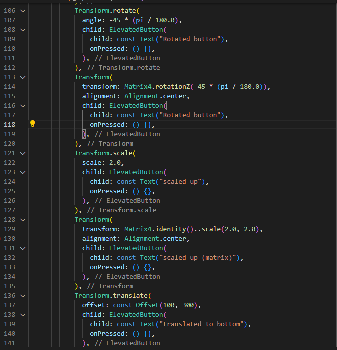
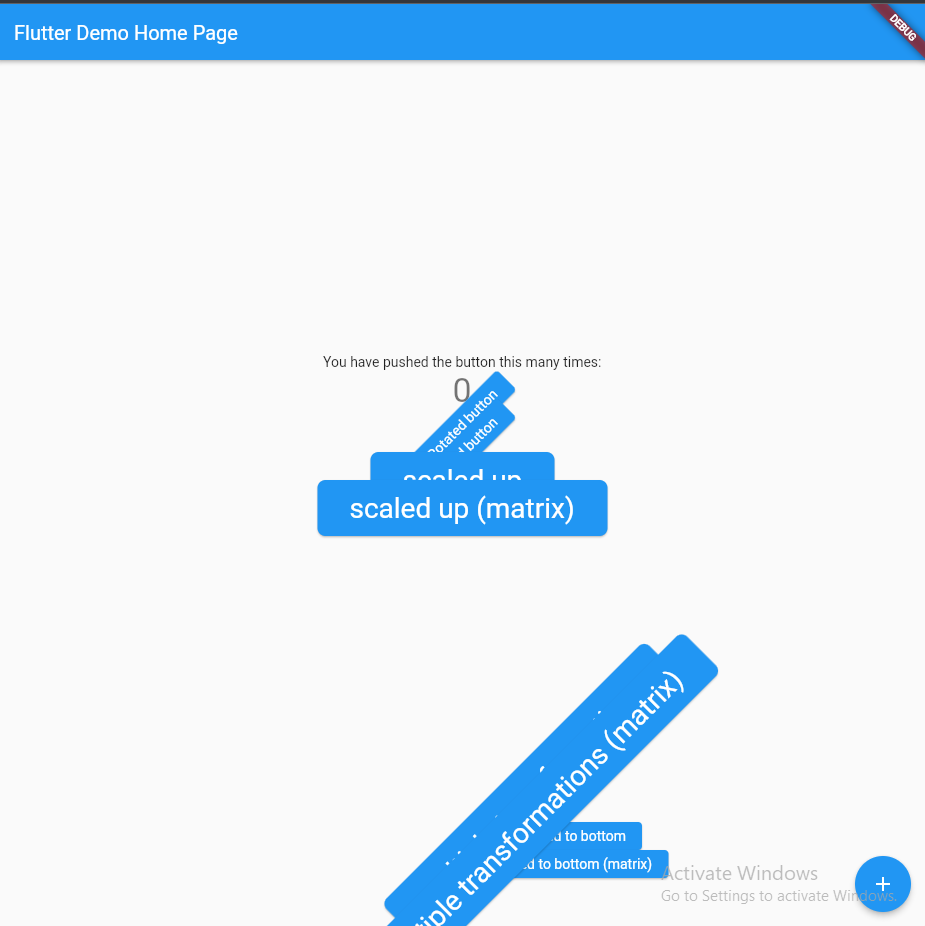
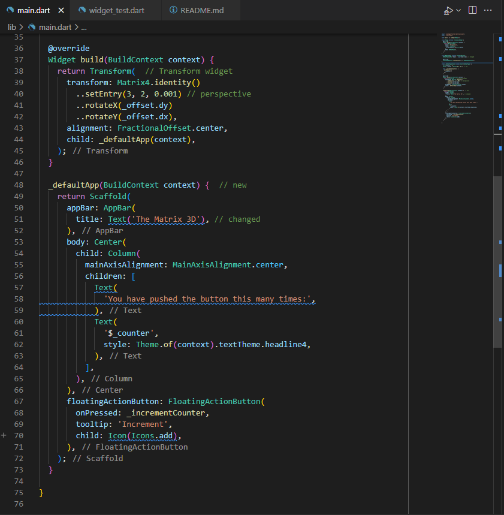
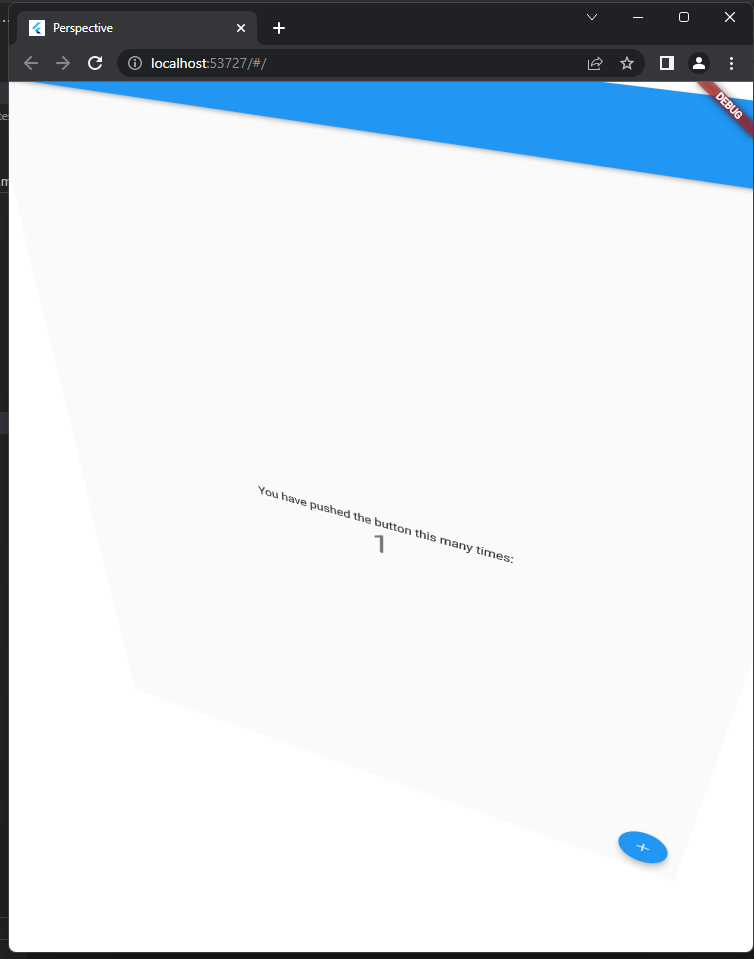
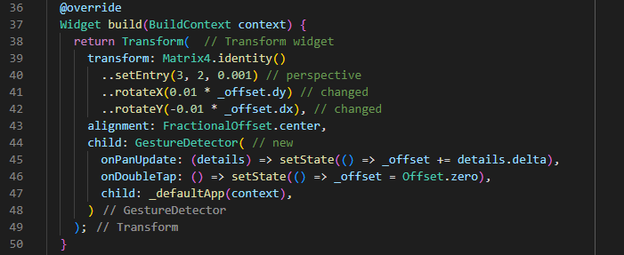
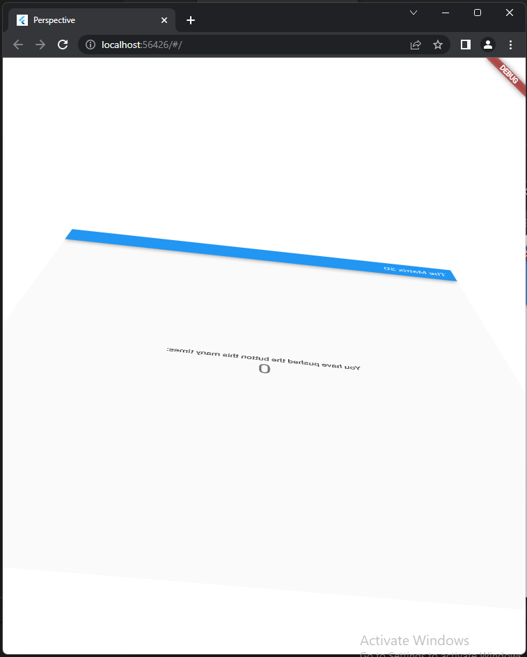

# flutter_transform

Praktikum 33 - TSA Manipulasi Widget

## Praktikum 1: Manipulasi Widget

1. Tambahkan library dart:math pada file main.dart

``` import 'dart:math'; ```

2.  Menambahkan kode Transform dengan menambahkan widget Transform.rotate pada class _MyHomePageState



3. Hasil Running



## Praktikum 2: Perspective on Flutter

1. Menambahkan widget transform pada file main.dart



2. Hasil Running



3. Menambah interaksi dengan menambahkan widget GestureDetector pada main.dart



4. Hasil Running

